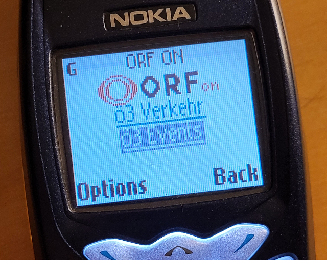

# wap.orf.at

A recreation of the ORF WAP portal. [ORF](https://www.orf.at) is the Austrian Public Broadcasting service.

You can use the site by pointing your WAP browser to **[waporf.karpour.net](http://waporf.karpour.net)**

The markup is based on [the archived pages of wap.orf.at](https://web.archive.org/web/*/http://wap.orf.at:80/*), however changes were made:

- Images had to be recreated as these have not been archived and could not be found
- Futurezone is not part of ORF anymore and was removes
- Kultur is not a separate category in the ORF news feed

The server uses [lru-cache](https://www.npmjs.com/package/lru-cache) for caching. Caching could be optimized, but will do for now.

Depending on the user agent accept header, the server will either serve `gif` or [`wbmp`](https://en.wikipedia.org/wiki/WBMP) images.

## Sections

### News

For news sources the following RSS feeds are used:

- [oe3 news](https://rss.orf.at/oe3.xml)
- [orf news](https://rss.orf.at/news.xml)
- [orf sport](https://rss.orf.at/sport.xml)

Headlines and links to stories are parsed from the feed. The stories themselves are scraped and parsed using JSDom.
For every story, the paragraphs and the first image are extracted. The image is scaled down using imagemagick and served on the article page either as `gif` or `wbmp`.

### Traffic information

For traffic info the API endpoint of Ö3 is used:

[oe3 Verkehrsinfo](https://oe3meta.orf.at/oe3api/ApiV2.php/TrafficInfo.json)

# Dependencies

- [express](https://www.npmjs.com/package/express) - HTTP server
- [ejs](https://www.npmjs.com/package/ejs) - Template engine
- [express](https://www.npmjs.com/package/rss-parser) - For parsing the ORF RSS feeds
- [jsdom](https://www.npmjs.com/package/jsdom) - For extracting article data
- [html-entities](https://www.npmjs.com/package/html-entities) - For encoding strings in WML
- [lru-cache](https://www.npmjs.com/package/lru-cache) - For caching articles

Furthermore, [imagemagick](https://imagemagick.org) must be installed

# TODO

- [x] Improve LRU caching
- [x] Add screenshots
- [ ] Add XHTML/WAP2 support